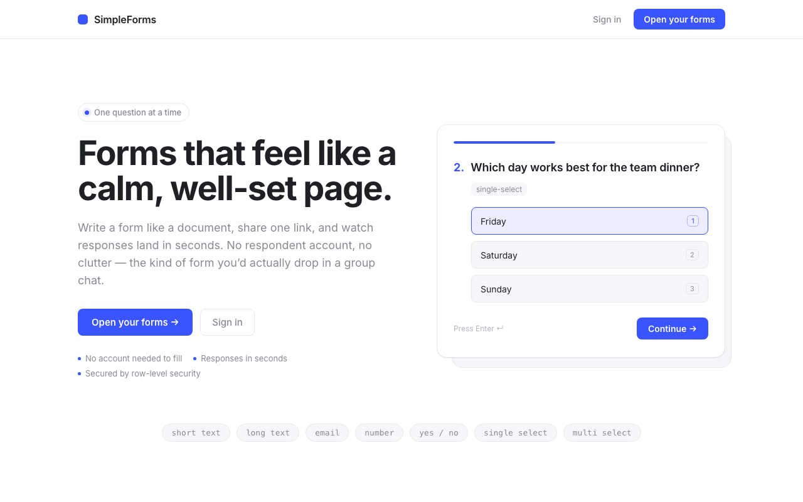
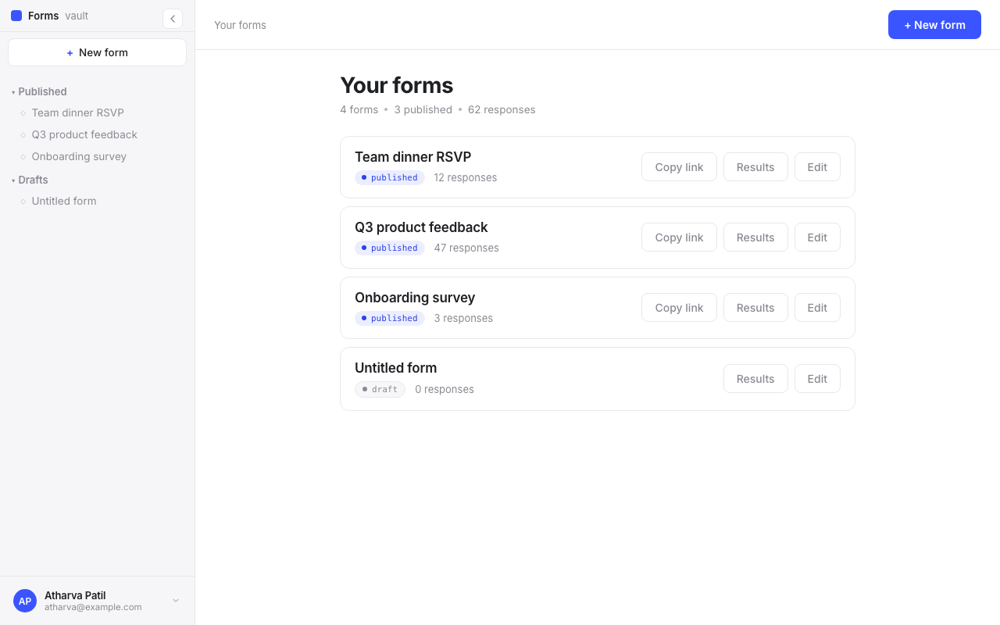
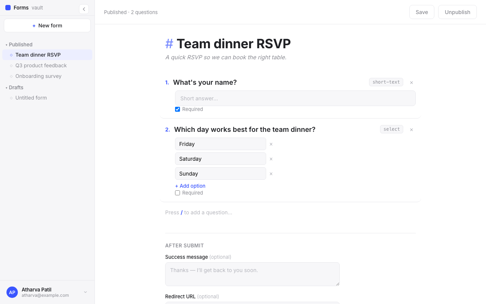
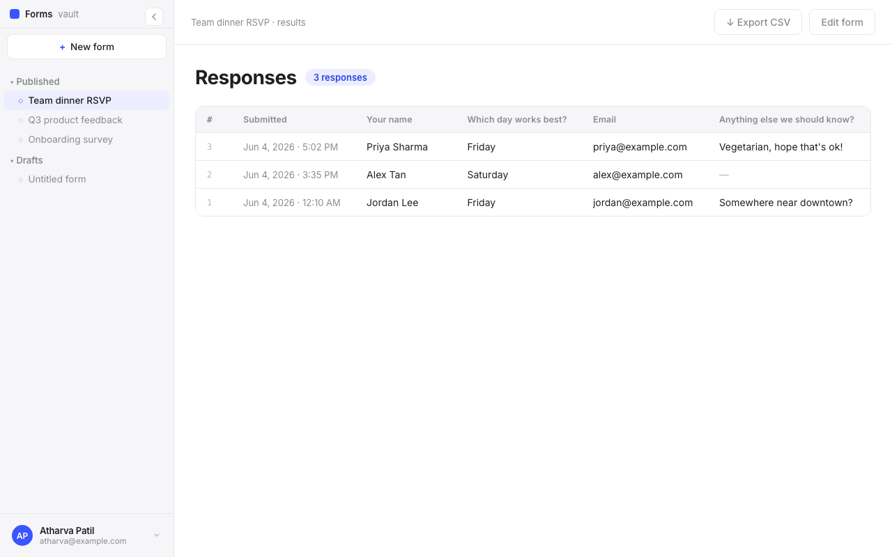
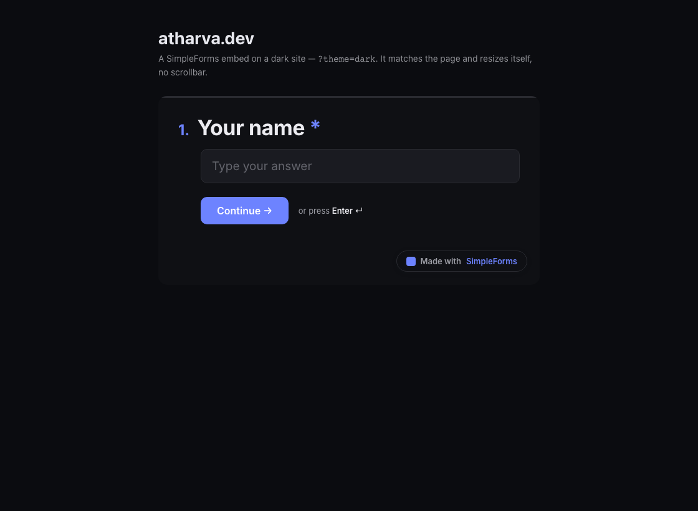

<div align="center">

# SimpleForms

### Forms that feel like a calm, well-set page.

One question at a time. No account needed to fill. Drop the link in a group chat — or embed it on your site in two lines.

[**🚀 Live demo**](https://simple-forms-three.vercel.app) · [Report a bug](https://github.com/atharva-patil-23/SimpleForms-/issues) · [Request a feature](https://github.com/atharva-patil-23/SimpleForms-/issues)


</div>

<p align="center">
  
</p>

## Why I built this

Every form tool I tried felt like a spreadsheet wearing a costume. Cluttered builders, forms that scream "MARKETING," ten fields stacked in a grey box. I wanted the opposite: a form you'd actually feel okay sending to a friend. So SimpleForms is built around one idea — **ask one question at a time, on a clean page, and get out of the way.**

You write a form like you'd jot a note (`#` heading, numbered questions, `/` to add the next one), publish it, and share one link. Whoever you send it to fills it out with zero friction — no signup, no app chrome — and the answers show up in your dashboard within seconds.

## ✨ What you get

- **🧘 A filling experience that respects people.** One question per screen, keyboard-first (Enter to advance), generous whitespace. Higher completion, less dread.
- **📝 A builder that feels like a doc.** Markdown-style heading, numbered questions, `/` to add. If you've used a notes app, you already know how to use it.
- **🔗 One link, no account to fill.** Anonymous respondents, on any device. Share it anywhere.
- **🧩 Embed it anywhere.** Copy-paste an `<iframe>` that **auto-resizes** to fit. Pass `?theme=dark|light|auto` so it matches the host site — and re-sync live when the page toggles themes. ([jump to embedding](#-embedding))
- **📊 Responses as a real table.** Spreadsheet view with a sticky header, plus **one-click CSV export** for the spreadsheet diehards.
- **🕒 Snapshotted answers.** Every response stores the form *as it was* at submit time, so editing the form later never rewrites your history.
- **⚙️ Your account, your call.** Settings page to rename yourself or permanently delete your account (and everything in it).
- **🎨 Seven question types, one accent color.** short text · long text · email · number · yes/no · single select · multi select.

| Your forms, at a glance | Write a form like a doc |
| :---: | :---: |
|  |  |
| **Responses as a table + CSV export** | **Embed anywhere, any theme** |
|  |  |

## 🚀 Try it

The live app is at **[simple-forms-three.vercel.app](https://simple-forms-three.vercel.app)** — sign in with Google, write a form, share the link.

Want to run it yourself? See [Run it locally](#-run-it-locally).

## 🧩 Embedding

Publish a form, hit **"Embed on a website"** in the editor, and copy the snippet. It's a self-contained `<iframe>` plus a tiny resize listener — no SDK, no dependencies:

```html
<iframe src="https://simple-forms-three.vercel.app/f/YOUR_SLUG?embed=1"
        style="width:1px;min-width:100%;border:0;" height="600"></iframe>
<script>
  window.addEventListener("message", function (e) {
    if (e.origin !== "https://simple-forms-three.vercel.app") return;
    var d = e.data || {};
    if (d.type === "simpleforms:resize" && typeof d.height === "number") {
      document.querySelector('iframe[src*="/f/YOUR_SLUG"]').style.height = d.height + "px";
    }
  });
</script>
```

**Theme it.** Add `?theme=dark`, `?theme=light`, or `?theme=auto` (follows the visitor's OS). To re-sync when *your* site's theme toggles, post a message to the iframe:

```js
iframe.contentWindow.postMessage({ type: "simpleforms:theme", theme: "dark" },
  "https://simple-forms-three.vercel.app");
```

The form only ever sends a height outward and only accepts a whitelisted theme string inward — nothing sensitive crosses the frame. You can also set a **custom success message** or a **redirect URL** per form from the editor's *After submit* settings.

## 🛠 Built with

- **Next.js (App Router) + TypeScript** — front and edges
- **Supabase** — Postgres, Auth (Google OAuth), Row-Level Security
- **Zod** — the single source of truth for question + answer shapes
- **Plain CSS** — a tiny design system (one cobalt accent, hairlines, Inter). No UI kit, no Tailwind.
- **Vercel** — deploys on push

No bloat. No 40-dependency form library. The whole thing is small on purpose.

## 🔒 How it stays safe

```text
Respondent (anon) ──fill──▶  /f/[slug]            reads the published form (RLS)
        │
        └─POST answers──▶ /api/forms/[slug]/responses   ← THE TRUST BOUNDARY
                            rate limit → published check → per-form cap →
                            Zod validate against the form's own schema →
                            insert (schema snapshotted into the response)

Creator (Google OAuth) ──▶  /dashboard  /forms/[id]  /forms/[id]/results
                            owner-scoped reads & writes, all via RLS
```

The submit endpoint is the **only** place anonymous input becomes a database write, and it's guarded twice: in the app (Zod + rate limit + per-form cap) and again at the database by an RLS `WITH CHECK` published-only insert policy. Row-Level Security is the entire authorization story — the app runs on the anon key. The single exception is account deletion, which uses a server-only service-role client (`SUPABASE_SERVICE_ROLE_KEY`) because the auth admin API can't run under RLS.

## 💻 Run it locally

You'll need **Node 20+**, **Docker** (for the local Supabase stack), and the Supabase CLI (`npx supabase` works without a global install).

```bash
git clone https://github.com/atharva-patil-23/SimpleForms-.git
cd SimpleForms-
npm install

# 1. Boot local Supabase (Postgres + Auth + Studio), applies every migration
npm run db:start

# 2. Point the app at the local stack — copy the printed anon key
cp .env.local.example .env.local   # set NEXT_PUBLIC_SUPABASE_URL + ANON_KEY

# 3. Go
npm run dev                        # http://localhost:3000
```

<details>
<summary><strong>Google sign-in (local)</strong> — one-time setup</summary>

Auth rides on Google OAuth. To sign in locally:

1. **Google Cloud Console** → APIs & Services → Credentials:
   - Configure the OAuth consent screen (External; add yourself as a test user).
   - Create an **OAuth client ID** → *Web application*.
   - Add this **Authorized redirect URI** (Supabase's local callback, not the app's):

     ```text
     http://127.0.0.1:54321/auth/v1/callback
     ```

2. Copy the credentials into a gitignored env file:

   ```bash
   cp .env.google.local.example .env.google.local   # paste your client ID + secret
   ```

3. Start the stack with the launcher that loads them: `npm run db:start`.

`supabase/config.toml` already enables the Google provider, allows
`http://localhost:3000/auth/callback`, and sets `skip_nonce_check = true` for
local sign-in. Flow: `/login` → Google → Supabase `/auth/v1/callback` → app
`/auth/callback` → `/dashboard`.
</details>

## 🧪 Tests

```bash
npm test            # all Vitest suites (unit + integration)
npm run test:rls    # RLS assertions — the security spine (needs the stack)
npm run test:e2e    # Playwright: full create→publish→fill→submit→results loop
```

- **Unit** — every question type + the runtime answer validator. No infra.
- **RLS integration** — pins down exactly what anon vs. owners can and can't do.
- **Submit integration** — the trust boundary (valid / invalid / closed / cap / rate limit) against the real anon client.
- **E2E** — the whole loop through a real browser, including auth gating and cross-user isolation.

Integration + e2e suites need `npm run db:start` running first.

## 🚢 Deploy

Auto-deploys to **Vercel** on push to `main`. Set these env vars in the project:

| Variable | What it's for |
|---|---|
| `NEXT_PUBLIC_SUPABASE_URL` | Your Supabase project URL |
| `NEXT_PUBLIC_SUPABASE_ANON_KEY` | Public anon key (RLS does the rest) |
| `NEXT_PUBLIC_SITE_URL` | Where the app lives (OAuth redirect) |
| `SUPABASE_SERVICE_ROLE_KEY` | **Server-only.** Powers account deletion |

Database lives in a hosted Supabase project. Push schema changes with `npx supabase db push`, and add `https://your-domain/auth/callback` to both the Google client and the Supabase auth allow-list.

## 🗺 Roadmap

Embed exists to answer one question: *does anyone actually embed?* What's next depends on the answer.

- [ ] Button → popup/drawer embed (the full one-question experience in an overlay)
- [ ] Webhooks / email-on-submit
- [ ] More question types (date, rating, file upload)
- [ ] Response analytics (completion rate, drop-off)
- [ ] Light theming controls (match-your-brand)

Got an idea? [Open an issue.](https://github.com/atharva-patil-23/SimpleForms-/issues)

## 📂 Project layout

```text
app/
  f/[slug]/                 the filling experience (the hero) + ?embed=1 + ?theme=
  api/forms/[slug]/responses route handler — the trust boundary
  dashboard/                your forms (single embedded-count query)
  forms/[id]/               builder editor (+ embed snippet, after-submit settings)
  forms/[id]/results/       responses table + CSV export
  settings/                 profile + account deletion
  login/  auth/             Google OAuth
components/
  fill/                     one-question-at-a-time reducer experience
  app/                      vault sidebar, profile menu, editor, dialogs
  landing/                  marketing page bits
lib/
  schema/                   Zod question types + runtime answer validator
  supabase/                 client factory (browser / server / middleware / admin)
  responses-table.ts        shared table + CSV model
supabase/migrations/        schema + RLS policies (the security spine)
```

## 🤝 Contributing

It's a small, opinionated codebase — PRs and issues welcome. If you're changing the security spine (RLS, the submit boundary), please add a test; that's the one place I'm strict.

## 📄 License

MIT — do what you want with it.

---

<div align="center">

Built by [Atharva](https://github.com/atharva-patil-23) · because forms shouldn't feel like paperwork.

If SimpleForms is useful to you, a ⭐ on the repo means a lot.

</div>
